# Electron in an Electromagnetic Field

A simulation of charged-particle motion in electric and magnetic fields, solved
twice: classically, by integrating the Lorentz force, and quantum mechanically,
by solving the Schrödinger equation with minimal coupling. The two halves meet
in one result: a classical cyclotron orbit and a Landau level are the same
object at different scales, and the quantized orbit radii `r_n = l_B√(2n+1)`
are exactly the classical radii that survive quantization.

Everything here was predicted analytically before it was measured numerically.
Turning points, drift velocities, eigenfrequencies, convergence orders, each
figure shows a derived curve and simulated data landing on it.


<table>
<tr>
<td align="center">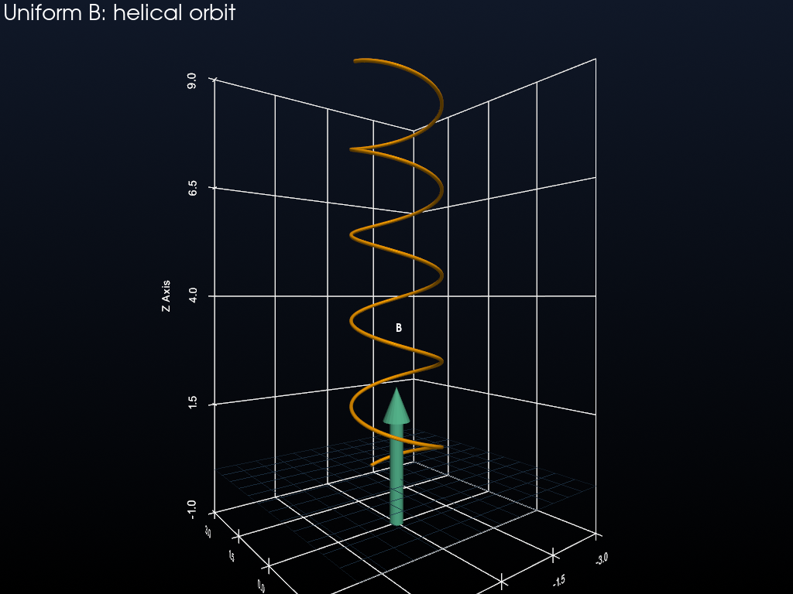<br><sub>Uniform B: helix</sub></td>
<td align="center">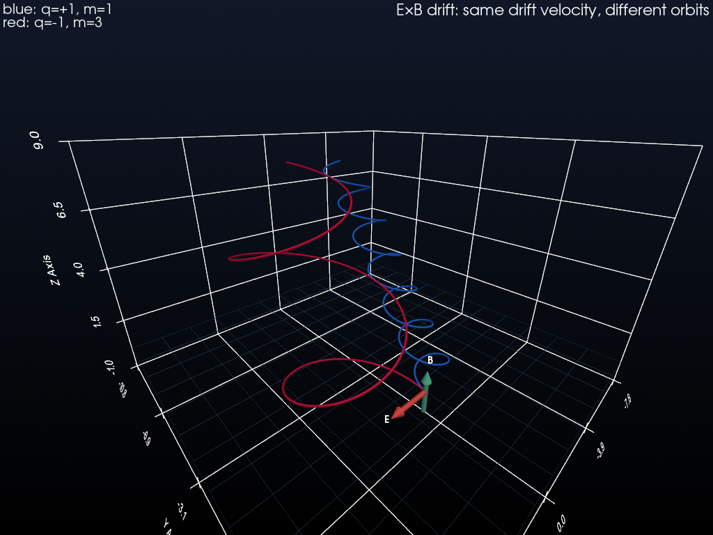<br><sub>E×B drift</sub></td>
<td align="center">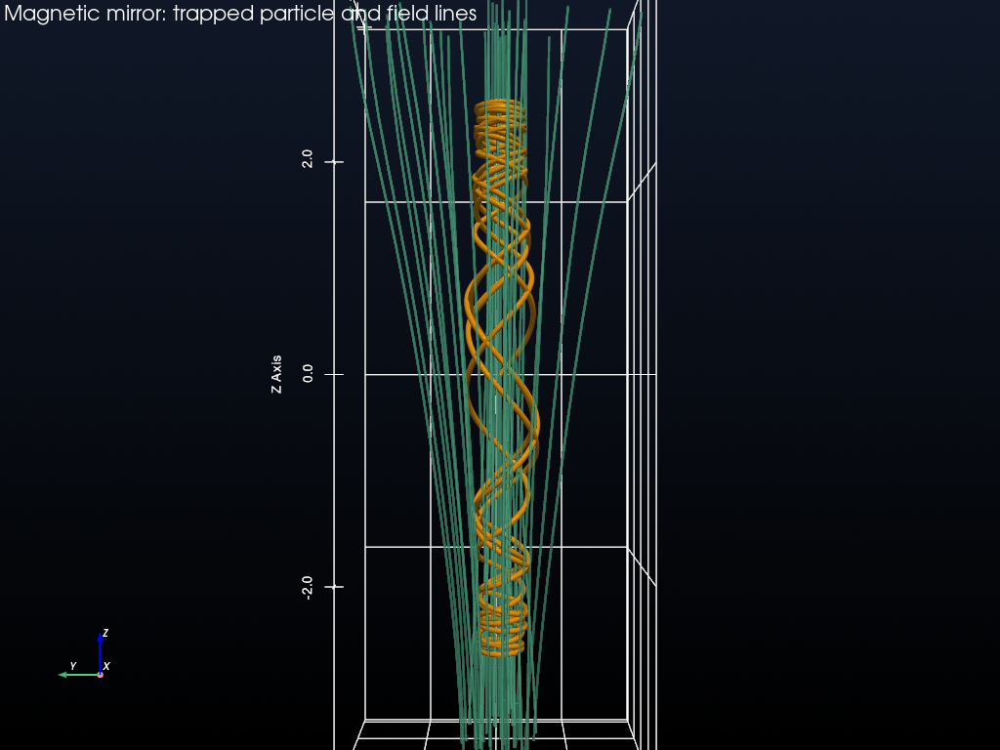<br><sub>Magnetic mirror</sub></td>
</tr>
<tr>
<td align="center">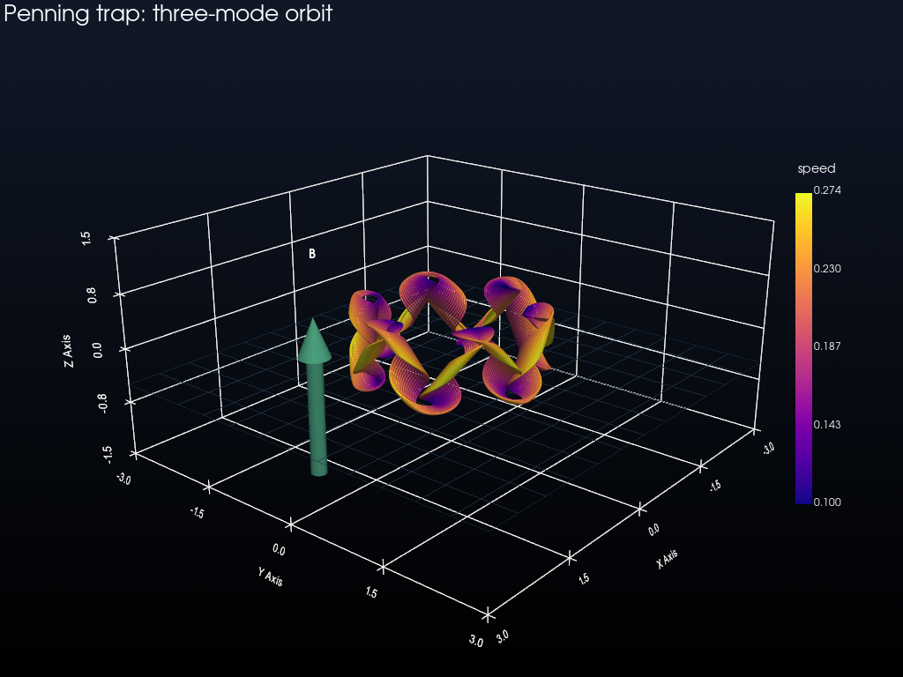<br><sub>Penning trap</sub></td>
<td align="center">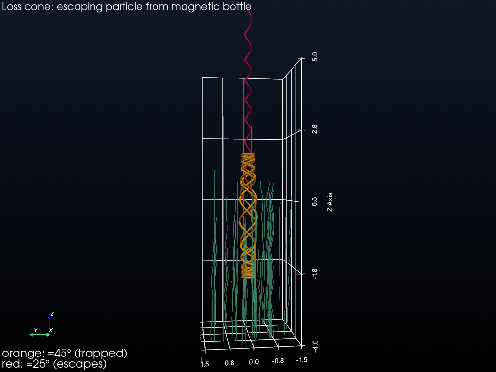<br><sub>Loss cone</sub></td>
<td align="center">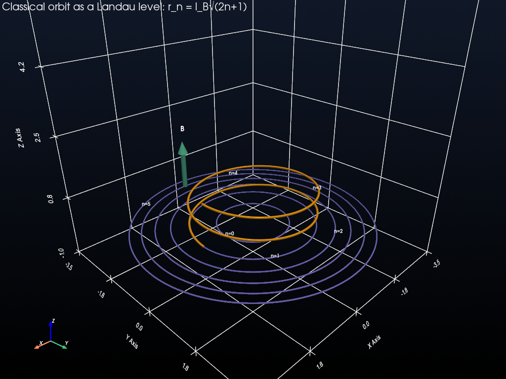<br><sub>Classical → quantum</sub></td>
</tr>
</table>


## What it does

**Classically**, it integrates the Lorentz force `F = q(E + v×B)` for a single
charged particle across five field configurations: a uniform magnetic field,
crossed E and B, a parabolic magnetic mirror, a magnetic bottle with a genuine
throat, and a Penning trap. Three integrators are implemented, Boris, RK4, and
forward Euler, so that the choice of method can itself be examined rather than
assumed.

**Quantum mechanically**, it solves the Schrödinger equation for an electron in
a uniform magnetic field by minimal coupling, `p → p − qA`. In the Landau gauge
the two-dimensional problem separates into a one-dimensional harmonic oscillator,
which becomes a tridiagonal matrix on a discretized grid. Its eigenvalues are the
Landau levels.

The two halves are not independent. A classical orbit of radius `r` has energy
`½mω_c²r²`; a Landau level has energy `ħω_c(n + ½)`. Requiring them to agree
selects a discrete set of radii, `r_n = l_B√(2n+1)`, out of the classical
continuum. That correspondence is the project's central result.


## Units

Everything is in natural units: `q = m = ħ = B₀ = 1`, so `ω_c = qB/m = 1`.

Time is therefore measured in units where one gyroperiod is 2π, and length in
Larmor radii. The magnetic length `l_B = √(ħ/qB)` is also 1, which is what allows
classical and quantum radii to be plotted on the same axis.

In SI a typical gyroradius is ~1e-3 m while `ħω_c` is
~1e-27 J, and comparing them means mixing twenty orders of magnitude with no
way to tell by eye whether a result is sensible. In natural units every quantity
is O(1): a radius reads 1.0 when correct, and 0.98 is visibly wrong. Errors are
relative, so tolerances mean the same thing everywhere.

Charge and mass remain function arguments, since the E×B result depends on
comparing particles with different `q` and `m`.


## Method

### Classical: the Boris pusher

Each step is split into three parts, half-step electric acceleration, a pure
magnetic rotation, and a second half-step electric acceleration:

    v⁻ = v + (qΔt/2m)E
    t = (qΔt/2m)B, s = 2t/(1 + |t|²)
    v′ = v⁻ + v⁻ × t
    v⁺ = v⁻ + v′ × s
    v_next = v⁺ + (qΔt/2m)E
    x_next = x + Δt·v_next


The middle step is an exact rotation, and rotations preserve vector length
identically, so `|v|` is conserved to machine precision regardless of step size.
This is why Boris is standard in plasma and accelerator codes despite being only
second-order accurate: what matters over millions of steps is that the energy
error is *bounded*, not that it is small.

The scheme is a leapfrog, so velocity lives at half-integer time steps and `v₀`
must be pushed backward by `Δt/2` at initialization.

The simplest case, a uniform field, produces a helix, circular gyration at fixed
radius combined with free motion along the field line, because the magnetic force
does no work:


### Quantum: reduction to a tridiagonal eigenproblem

In the Landau gauge `A = (0, B₀x, 0)`, the vector potential has no y-dependence,
so `p_y` is conserved and the wavefunction separates as `ψ = e^{ik_y y}φ(x)`.
Substituting into the minimally-coupled Hamiltonian leaves

    −½ φ″ + ½ ω_c²(x − x₀)² φ = E φ, x₀ = −ħk_y/(qB₀)


a shifted one-dimensional harmonic oscillator. Discretizing the second derivative
with the three-point stencil `[1, −2, 1]/Δx²` gives a tridiagonal matrix: the
kinetic term contributes `1/Δx²` on the diagonal and `−1/(2Δx²)` off it, and the
potential adds `½(xᵢ − x₀)²` to the diagonal. `scipy.linalg.eigh_tridiagonal`
returns the spectrum directly.

Both halves therefore rest on the same numerical idea, a second-order central
difference, applied to time in one case and space in the other, and both
converge at the expected `O(h²)`.


## Results

### Boris conserves what RK4 doesn't

The magnetic force is always perpendicular to velocity, so `|v|` must be exactly
constant in a pure **B** field. The Boris pusher splits each step into a half
electric kick, an exact rotation, and a second half kick, and because rotations
preserve length identically, speed is conserved at any step size.

Over 10⁵ steps in a uniform field:

| Integrator | Final relative \|v\| error |
|---|---|
| Euler | ~50 |
| RK4 | ~1e-9, monotonically rising |
| Boris | ~1e-15, bounded |

The distinction that matters is not size but shape. RK4's error is small and
*growing*; Boris's is tiny and *bounded*. Running each at two step sizes makes
this structural: RK4's curves separate vertically but keep the same slope, while
Boris's two curves lie on top of each other, because its conservation was never
a resolution effect.

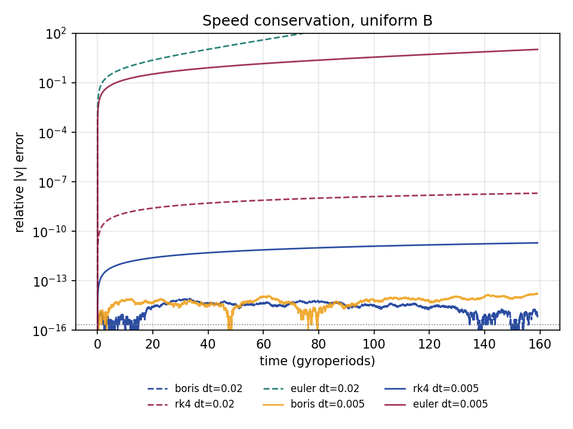


### Second-order convergence, matched to theory

Boris rotates by `2·arctan(ω_c·Δt/2)` rather than `ω_c·Δt`, which expands to a
relative period error of `(ω_c·Δt)²/12`. Measured across four step sizes, the
log-log slope is 2.000 and the data sits on the predicted curve without fitting.

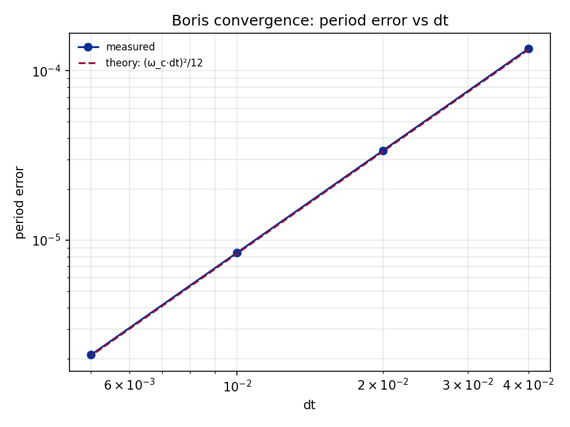


### E×B drift is mass- and charge-independent

Adding an electric field perpendicular to **B** makes the guiding centre slide at
`v_d = (E×B)/B²`, perpendicular to both fields, and identical for every particle
regardless of `q` or `m`. A particle launched at exactly `v_d` travels in a
straight line: the electric and magnetic forces cancel, `max|x| = 0.00e+00`.

With a perpendicular kick added, `q=+1, m=1` and `q=−1, m=3` trace cycloids of
very different size that rotate in opposite directions, and drift together.

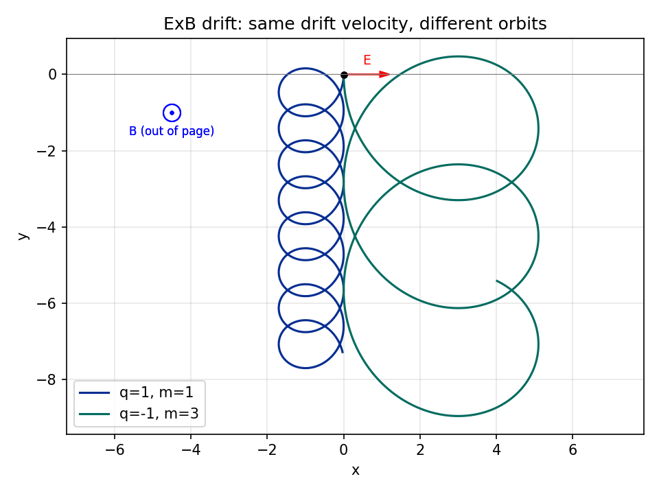


### A magnetic mirror traps a particle

Where field lines pinch, `B` grows. The magnetic moment `μ = mv⊥²/2B` is an
adiabatic invariant, conserved not exactly, but to high accuracy whenever the
field varies slowly compared to one gyration. Since total speed is fixed,
rising `v⊥²` forces `v∥²` down, and the particle reflects where `v∥` reaches zero.

Predicted turning point from `B_turn/B₀ = |v|²/v⊥²`: **z = ±2.24**.
Simulated: **±2.24**.

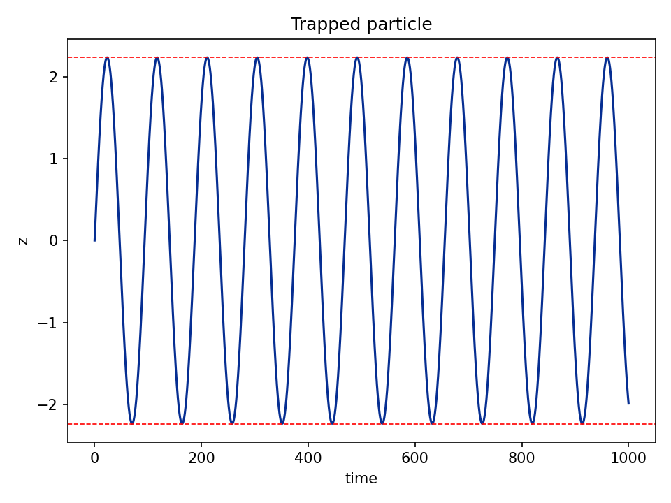

μ varies by 3 parts in 10⁵ over 160 gyrations, a bounded ripple at twice the
bounce frequency, with no drift.

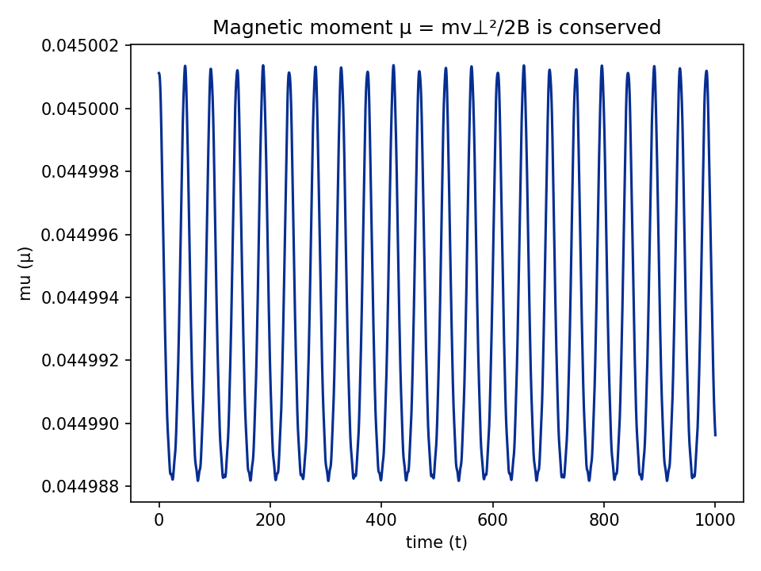


### The invariant is a scale separation, not a law

μ is conserved because the field varies slowly over one gyration, not because
any law requires it. Tightening the bottle brings the field's scale length toward
the gyroradius and the condition fails:

| k | μ variation |
|---|---|
| 0.05 | 3e-5 |
| 0.8 | 1.4e-2 |
| 5 | 1.0e-1 |

A 16× increase in field gradient degrades conservation by 400×. That superlinear
response is the signature of adiabatic breakdown. Even at k=5 the oscillation
stays bounded around 1.0, μ has become a poor invariant, not a meaningless one.

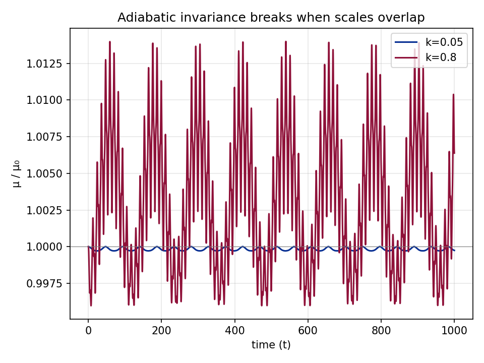


### The loss cone

Whether a particle is trapped depends only on its pitch angle, `sin²θ > 1/R`,
where `R = B_max/B₀`, not on its speed. A fast particle and a slow one with the
same angle share the same fate.

A parabolic field grows without bound, so every particle eventually turns around.
A real bottle needs a maximum: `B_z = B₀(1 + kz²e^(−z²/a²))` peaks at `z = ±a`,
giving `R = 1 + ka²e⁻¹ = 2.77` and **θ_loss = 36.8°**.

Three particles at identical speed: 60° and 45° bounce, 25° crosses the throat
and leaves on a straight line, beyond the maximum there is no gradient and no
restoring force.

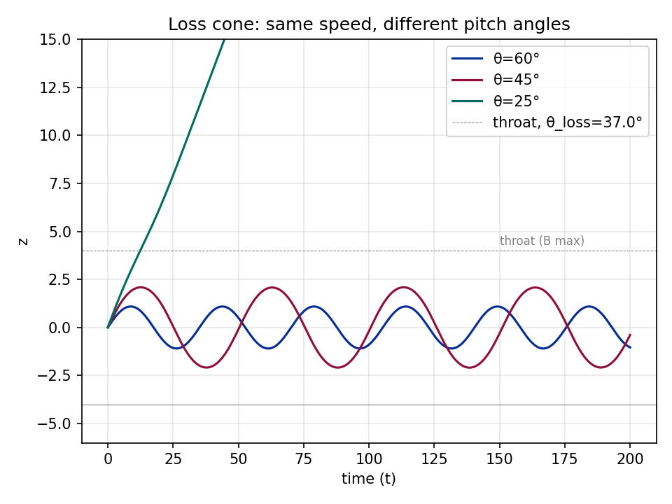

This is why magnetic mirror fusion leaks, and why particles scattered into the
loss cone in Earth's magnetosphere precipitate at the poles as aurorae.


### Penning trap: three modes, measured by FFT

Earnshaw's theorem forbids purely electrostatic confinement: `∇·E = 0` means any
potential confining along one axis expels along another. A Penning trap accepts
the saddle, an electrostatic quadrupole confines axially while the magnetic
field prevents radial escape. That tension produces three modes instead of two.

The axial mode decouples: `ω_z = √(2qC/m)`. The radial equations couple through
`v × B`, giving a quadratic whose roots are the modified cyclotron and magnetron
frequencies. Two exact identities follow, and both hold to 1e-6 before any
integration:

- `ω'_c + ω_m = ω_c`
- `ω'_c · ω_m = ω_z²/2`

The x–y projection is a dense annulus: a fast cyclotron circle precessing slowly
around a magnetron circle.

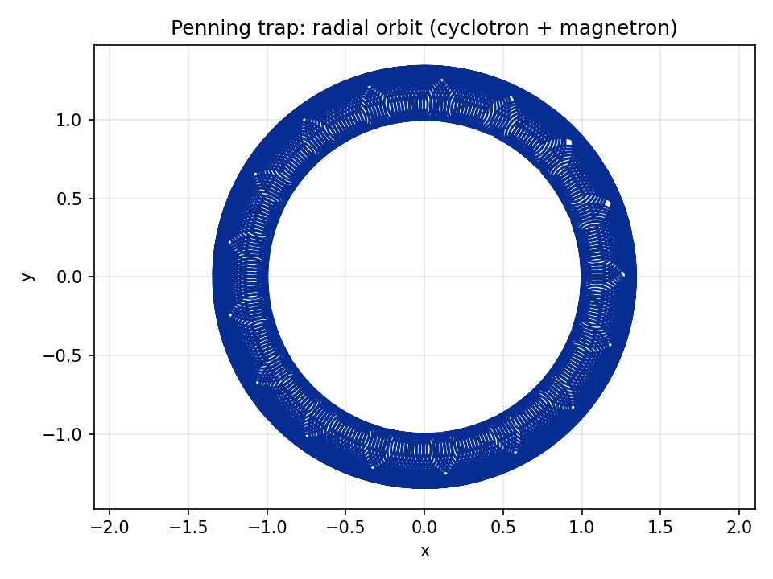
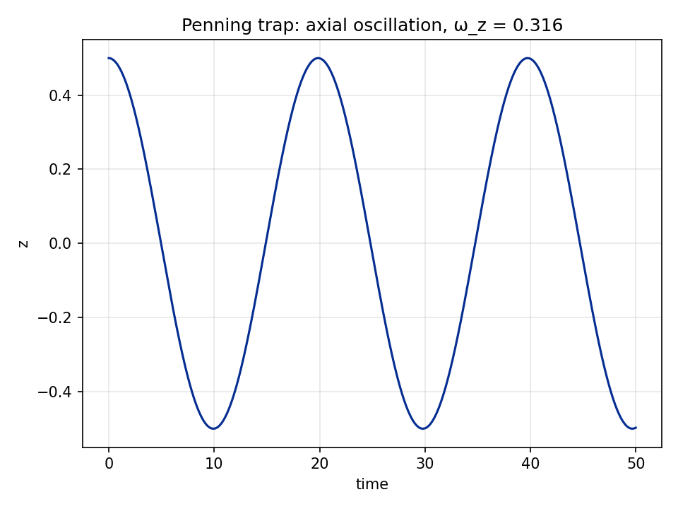


FFT of the trajectory recovers all three frequencies:

| mode | measured | predicted |
|---|---|---|
| ω_m | 0.0534 | 0.0528 |
| ω_z | 0.3173 | 0.3162 |
| ω'_c | 0.9488 | 0.9472 |

All within one FFT bin (0.0031). The errors grow with frequency in one direction, 
that is Boris's `(ωΔt)²/12` phase error, so even the residual is accounted for.

The x-spectrum shows only ω'_c and ω_m; the z-spectrum only ω_z. Radial and axial
motion do not mix, confirming the separation assumed in the derivation.

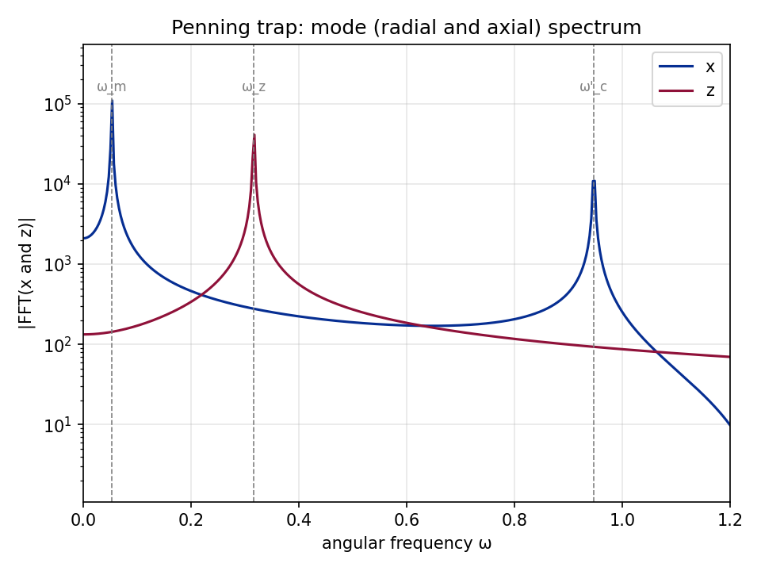


### Landau levels from a matrix eigenvalue problem

Quantum mechanically the field enters through the vector potential, not **B**:
minimal coupling replaces `p` with `p − qA`. In the Landau gauge
`A = (0, B₀x, 0)`, **A** has no y-dependence, so `p_y` is conserved and
`ψ = e^{ik_y y}φ(x)` separates. What remains is a shifted 1D harmonic oscillator, 
the two-dimensional quantum problem collapses to an ODE.

Discretizing the second derivative with a three-point stencil gives a tridiagonal
Hamiltonian whose eigenvalues are:

    n=0 0.499997 n=3 3.499922
    n=1 1.499984 n=4 4.499872
    n=2 2.499959 n=5 5.499809

The ladder `E_n = ħω_c(n + ½)`, obtained numerically. Errors grow with n and
converge at second order in Δx, the same central-difference scaling as the
Boris pusher, in space rather than time.

The energy depends on `k_y` only through the oscillator's centre `x₀`, not its
depth. Computing at `x₀ = 0, +2, −3` gives eigenvalues agreeing to 1e-12: the
degeneracy is exact, and it is the foundation of the quantum Hall effect.

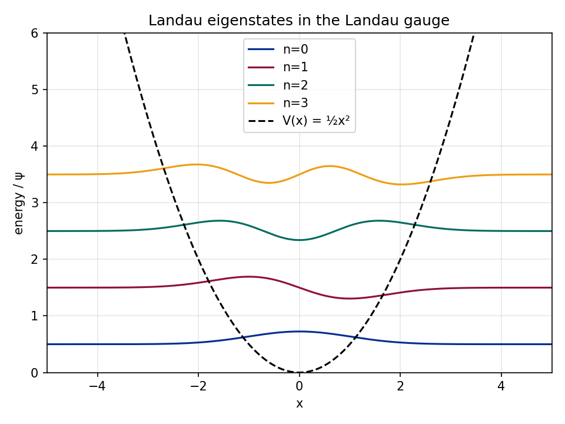

State `n` has exactly `n` nodes, and each wavefunction dies where the parabola
crosses its energy, the classical turning point.

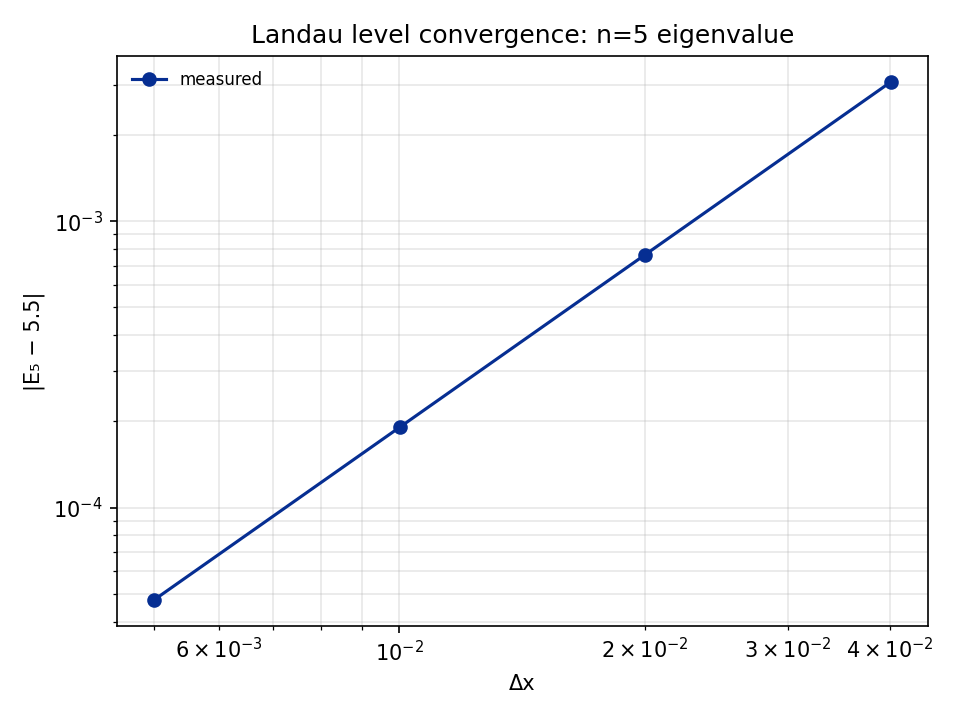


### The bridge

Classically, `E = ½mω_c²r²`: any radius is allowed. Quantum mechanically,
`E_n = ħω_c(n + ½)`. Setting them equal:

    r_n = √(ħ(2n+1)/mω_c) = l_B√(2n+1)

Same parabola. Only certain points on it exist: 1.00, 1.73, 2.24, 2.65, 3.00,
3.32 in units of the magnetic length.

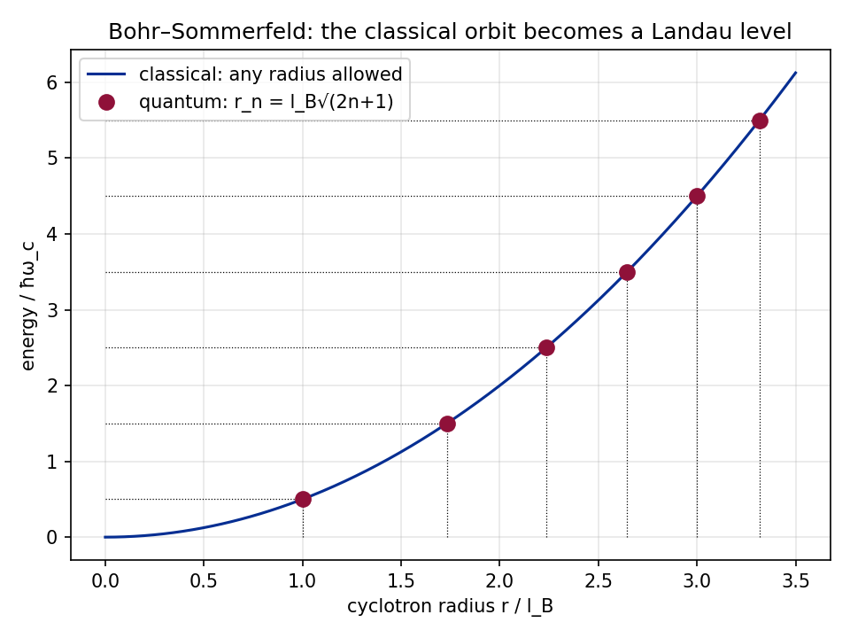

The spacing shrinks as n grows even though energy spacing is uniform, because
`E ∝ r²`. That is the correspondence principle made visible: at large n the
allowed radii crowd together and discreteness becomes unobservable, which is why
quantized orbits are never noticed in a laboratory cyclotron.

Rendered in 3D, the classical helix sits exactly on the n=1 ring, one allowed
member of a discrete family.


And the two calculations agree independently: the n=0 wavefunction dies at
x = ±1, the n=1 at ±1.73. Those are the same numbers as the quantized radii.


## Validation

Thirty tests, run with `pytest` from the project root.

**Integrators:** speed conservation below 1e-12 over 10⁴ steps; gyroradius and
period within 1e-3 of their analytic values; second-order convergence confirmed
by asserting the error ratio between two step sizes falls between 3.5 and 4.5;
E×B drift matching `(E×B)/B²` for two different charge–mass pairs; Boris and RK4
agreeing to 1e-5 at small step size, which would catch a bug in either.

**Fields:** every field is divergence-free to 1e-9, checked by central
differences; the Penning field satisfies `∇·E = 0`; every field returns two
shape-(3,) arrays, which catches interface violations; the bottle field's `|B|`
has a genuine maximum at the throat, which is what makes escape possible.

**Quantum:** the eigenvalue ladder matches `n + ½` to 1e-3; eigenvalues at
different oscillator centres agree to 1e-8, confirming degeneracy; the error in
`E₅` falls by a factor near 4 when the grid doubles; eigenstate `n` has exactly
`n` nodes.

Every test asserts against a value derived analytically, not against a stored
output, so they check the physics.


## How to run it
Install dependencies:
```bash
pip install -r requirements.txt
```
Then:

```bash
python main.py      # all 2D figures and printed diagnostics
python viz.py       # all 3D scenes and the animation
pytest              # 30 tests
```
`main.py` opens each matplotlib figure in turn and writes it to `figures/`;
close each window to continue. `viz.py` opens interactive PyVista windows,
rotate with the mouse, press `q` to advance to the next scene.


## Project structure  

```
├── fields.py field (configurations: uniform, E×B, mirror, bottle, Penning)
├── pushers.py (integrators: Boris, RK4, Euler)
├── quantum.py (Landau level eigensolver)
├── analysis.py (numerical divergence, shared diagnostics)
├── main.py (classical + quantum runs, 2D figures, validation printouts)
├── viz.py (PyVista 3D scenes and animation)
├── conftest.py (marks the project root for pytest imports)
├── tests/
│ ├── test_pushers.py (conservation, convergence, drift, integrator agreement)
│ ├── test_fields.py (divergence, shapes, bottle maximum)
│ └── test_quantum.py (spectrum, degeneracy, convergence, node counting)
└── figures/ (all generated output)
```

Every field is a function `field(r, t) -> (E, B)` returning two shape-(3,)
arrays, so any field can be passed to any integrator. Fields with parameters
are built by factories: `make_bottle_field(k=0.3, a=4.0)` returns a closure
capturing those values.


## Future work

- **Relativistic Boris.** Push momentum `u = γv` instead of velocity, evaluating γ
at the half-step so the rotation uses `ω_c = qB/γm`. The gyroradius grows and the
period lengthens with energy.

- **Symmetric gauge.** The same physics in `A = ½B(−y, x, 0)` gives rotationally
symmetric eigenstates labelled by angular momentum rather than `k_y`. Different
wavefunctions, identical spectrum. The states are nested rings, which
would pair naturally with the bridge figure.

- **Coulomb interaction.** Two charges in the same trap, repelling each other.
Turns an external-field problem into an N-body one and shows the beginnings of
collective plasma behaviour. 

- **Aharonov–Bohm.** A solenoid the particle never enters, where `B = 0` everywhere
along its path but `A ≠ 0`. Interference fringes shift anyway, showing that the
vector potential is physically real and not just a computational convenience.


## References

**Boris algorithm.** J. P. Boris, "Relativistic plasma simulation, optimization
of a hybrid code," *Proc. 4th Conf. on Numerical Simulation of Plasmas* (1970),
pp. 3–67. The original. Qin et al., "Why is Boris algorithm so good?",
*Phys. Plasmas* **20**, 084503 (2013) explains the volume-preserving property
that makes its energy behaviour bounded rather than merely small.

**Bohr–Sommerfeld quantization of cyclotron orbits.** L. Onsager,
"Interpretation of the de Haas–van Alphen effect," *Phil. Mag.* **43**, 1006
(1952). The flux-quantization argument behind `r_n = l_B√(2n+1)`.

Background physics (guiding-centre drifts, adiabatic invariance, Penning trap
eigenmodes, Landau gauge) follows standard treatments in plasma physics and
quantum mechanics texts.